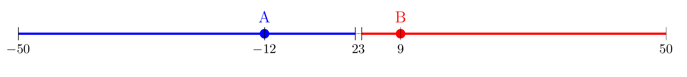

# Equilíbrio de Nash

Para introduzir o conceito mais importante da teoria dos jogos não-cooperativa, vamos começar por um jogo chamado de "p-beuaty contest".


## P-beauty contest

Escolha um número inteiro, entre 0 e 100. Vence o desafio quem acertar a metade da média dos números escolhidos por
todos os jogadores. Em outras palavras, vou anotar os números de cada um, computar a média e depois dividir a média
por 2. Portanto, vocês devem advinhar não a média dos números, mas a média dividida por 2.

Advinhar metade da média
Dividir em grupos de 10 (3 grupos).

Previsões: primeira vez 25. (uma rodada de dominância)
Segunda vez 10 (às vezes 5 ou 6) - duas ou três rodadas de dominância
Terceira vez: 3 ou 4. Mais uma rodada de dominância. Vários zeros.


## Melhor resposta

A ideia de melhor resposta é um conceito central para a teoria dos jogos, de modo que vale a pena defini-lo formalmente.

Definição 4.1: Melhor resposta: A estratégia $s_i \in Si$ é a melhor resposta do jogador $i$ às estratégias de seus oponentes $s_{-i} \in S_{-i}$ se

$v_i(s_i, s_{-i}) >= v_i(s^\prime_i, s_{-i})$ para todo $s^\prime_i \in S_i$

Em palavras: a utilidade (ou payoff) do jogador $i$ resultante da sua estratégia e das estratégias dos oponentes é pelo menos tão boa quanto qualquer outra estratégia que $i$ possa vir a adotar.


Considere o jogo da bandeira, do reality show Survivor. Se é sua vez de jogar e existem, por exemplo, 20 bandeiras, não importa o que você faça, irá perder o jogo se o outro time for racional. Portanto, sua melhor estratégia pode ser tanto 1, 2 ou 3 bandeiras. Esse exemplo mostra que a melhor estratégia pode 1: incluir múltiplas ações; 2. serem igualmente ruins e não fazer diferença nenhuma e resultar todas no mesmo payoff.

## Equilíbrio de Nash

Um perfil de estratégias é um equilíbrio de Nash se cada jogador está escolhendo a melhor resposta para o que acredita que os demais jogadores farão. Ou seja, todo mundo está simultaneamente escolhendo a melhor resposta uns para os outros.

O equilíbrio de dominância estrita requer apenas racionalidade, enquanto o equilíbrio de EIEED requeria racionalidade e conhecimento comum de crenças (e racionalidade). Agora, iremos fazer uma suposição mais forte ainda, de que as crenças, em certo sentido, estejam corretas. Isso dará origem ao equilíbrio de Nash, formulado pela primeir vez por John Nash em 1950.

Definição 5.1. O perfil de estratégias puras $s^\star = (s^\star_1, s^\star_2, ..., s^\star_n) \in S$ é um equilíbrio de Nash se $s^\star_i$ é uma melhor resposta a $s^\star_{-i}$ para todo $i \in N$. Ou seja,

$v_i(s^\star_i, s^\star_{-i}) >= v_i(s^\prime_i, s^\star_{-i})$, para toda $s^\prime_i \in S_i$ e todo $i \in N$.

Considere o jogo abaixo. O único equilibrio de EIEED é (Alto, Esquerda). Esse também é um equilíbrio de Nash, pois Alto é a melhor resposta a L, e L é a melhor resposta para Alto.

```{r results = "asis", echo=FALSE}
library(knitr)
pair <- function(x,y) sprintf("(%d,%d)", x,y)
all_pairs <- c(pair(4,3), pair(2,1), pair(3,0),
               pair(5,1), pair(8,4), pair(9,6),
               pair(6,2), pair(3,6), pair(2,8))
payoff.mat <- matrix(all_pairs, nrow=3)
dimnames(payoff.mat) <- c(list(c("Alto","Médio", "Baixo"), c("Esquerda", "Centro", "Direita")))
results = "asis"

kable(payoff.mat)
```

Considerem o Dilema do Prisioneiro. É fácil ver também que (C,C) é também um equilíbrio de Nash.

Não é coincidência que Dominância estrita, EIEED e racionazabilidade sempre sejam equilíbrios de Nash. Se um equilíbrio é de dominância estrita, o único sobrevivente de EIEED e de racionazabilidade, então é o único equilíbrio de Nash.

Considere o seguinte jogo. Duas jogadoras devem escolher um número inteiro entre 1 e 9. Se a soma dos números for menor ou igual a dez, elas ganham o valor em reais que cada jogadora escolheu. Se a soma for maior que dez, não ganham nada. Esse jogo é dado por $G = [N = 1,2; S_i = (1, 2, ..., 9), v_i(s_1, s_2) = s_i, se s_1 + s_2 <= 10$ $0$, c.c.]$

Quaaisquer pares $(1,9);(9,1)$, $(2,8), (8,2)$ etc. formam equilíbrios de Nash. Em particular, uma vez revelados, nenhum jogador possui qualquer incentivo **unilateral** a mudar sua estratégia.

Vamos enfatizar a palavra **unilateral** aqui. Vamos mudar o jogo anterior para o seguinte. Em vez das jogadoras ganharem os números ecolhidos cuja soma for 10, elas (cada uma) ganham a soma dos quadrados dos núemeros escolhidos. Assim, (1,9) e (9,1) geram $1^2 + 9^2 = 1 + 81 = 82$ reais, enquanto $2^2 + 8^2 = 4 + 64 = 68$ e $5^2 + 5^2 = 50$, de forma que o melhor resultado para as jogadoras é (9,1) ou (1,9). Porém, se jogarem (2,8), nenhuma delas possui incentivo **unilateral** para mudar sua estratégia, pois elas constituem melhores respostas as estratégias umas das outras.

 Uma das lições que precisamos tirar de modelos de teoria dos jogos é que não basta boa vontade ou objetivos comuns para uma ação coletiva. É preciso que os equilíbrios sejam tal que nenhum ator tenha um incentivo unilateral para mudar sua estratégia. Em certo sentido, os equilíbrios de Nash são sustentáveis, no sentido de que não há incentivo para desviar, uma vez estando em um deles. 
## Aplicação - Plano cruzado

Na década de 80, o Brasil enfrentou um grave problema de hiperinflação, levando o país a adotar o Plano Cruzado durante a presidência de Sarney para combater a inflação. O plano incluía várias medidas, sendo o congelamento de preços como a principal delas, o que impedia que os preços umentassem sem autorização governamental. Apesar do sucesso inicial em reduzir a inflação, o plano eventualmente fracassou, e os preços voltaram a subir. Uma parte do diagnóstico do Plano Cruzado é que existia uma inércia inflacionária, baseada meramente na expectativa de que haverá inflação. Ou seja, se um agente espera que haja inflação, ele reajusta os preços. Se todos fizerem isso, a inflação acontece e se repete mês a mês. Essa situação pode ser modelada como um jogo de coordenação, em que queremos transitar de um equilíbrio ruim (todos reajustam os preços) para um equilíbiro bom (ninguém reajusta os preços). A ideia do congelamento de preços é justamente mover a economia entre equilíbrios, algo que o mercado não conseguiria fazer soznho, sem intervenção governamental.

Para simplificar, suponhamos que temos apenas duas empresas que podem decidir reajustar os preços ou não. Se ambas não reajustam, não há inflação. Se só uma reajustar, ela perde mercado para a outra empresa. Se ambas reajustarem, há inflação.


```{r results = "asis"}
# Define Variables
M=2
R=3
P=1
S=0

# Assign Pairs
pair <- function(x,y) sprintf("(%d,%d)", x,y)
all_pairs <- c(pair(M,M), pair(S,R), pair(R,S), pair(P,P))
payoff.mat <- matrix(all_pairs, nrow=2)
dimnames(payoff.mat) <- c(rep(list(c("Não-reajusta","reajusta")), 2))
results = "asis"

# Plot 
kable(payoff.mat)

```

## Aplicação - Chile

Vamos começar modelando um exemplo "simples", adaptado do livro de Niou e Ordershook "Strategy and Politics. An introduction to Game Theory". Em 1964, no Chile, Salvador Allende era o candidato da esquerda. Liberais e Conservadores acetaram apoiar o candidato do centro Eduardo Frei, que ganhou a eleição com 56,1% dos votos contra 38,9% de Allende. Em 1970, Allende ganhou a eleição com menos votos do que havia recebido em 64, 36,2%, enquanto o centrista Randomiro Tomic ganhou 27,8% e direitsta Jorge Allesandri 34,9% dos votos. Especula-se que, se um dos candidatos desistisse da eleição, Allende não teria conquistado o poder.

Vamos então fazer um modelo simples para ilustrar a questão.

Suponha um eleitorado com três tipos de ordenamento de preferências de candidatas $A$, $B$ e $C$.
1. $A \succ B \succ C$ 
2. $B \succ C \succ A$ 
3. $C \succ B \succ A$ 

Vamos supor adicionalmente que 40% do eleitoradotem preferências do tipo 1 o restante igualmente dividido entre o tipo 2 e 3 (30% cada).

Se cada eleitor votar sinceramente (isto é, para sua candidata preferida), $A$ teira 40% dos votos, $B$ 30% e $C$ 30%. Se a regra for como no Brasil 1945-64, em que não havia segundo turno e a candidata mais votada vence, $A$ seria eleita. Se porém parearmos $A$ contra $B$, a vencedora seria $B$ com 60% dos votos, e $B$ contra $C$ também daria a vitória para $B$, com $70\%$ dos votos. Em casos como esse, em que há uma vencedora que ganha todas as disputas 2x2, chamamos de vencedora de Condorcet (Condorcet winner). $B$ e $C$, portanto, poderiam ser estratégicas e votarem não na candidata preferida para obter um resultado mais favorável. O problema que $B$ e $C$ enfrentam pode, portanto, ser modelado do seguinte modo.

```{r results = "asis", echo=FALSE}
library(knitr)
pair <- function(x,y) sprintf("(%s,%s)", x,y)
all_pairs <- c("B ganha", "A ganha", "A ganha", "C ganha")
payoff.mat <- matrix(all_pairs, nrow=2)
dimnames(payoff.mat) <- c(list(c("Votar em B","Votar em C"), c("Votar em B","Votar em C")))
results = "asis"

kable(payoff.mat)
```

Esse jogo é muito parecido com o jogo de coordenação Bach-Stravinsky. Há dois equilíbrios de Nash, B ganha e C ganha. Porém, a escolha de qual equilíbrio acontecerá requer coordenação entre eleitores do tipo 2 e 3. Se falharem em coordenar os votos, contudo, A ganhará. Se B ou C desistir de disputar a eleição, a coordenação estará garantida, como ocorreu no Chile em 1964. Na ausência de tal coalizão, eleitores terão muita dificuldade de coordenar seu voto.

Do ponto de vista da Ciência Política, é importante enfatizar alguns pontos dessa discussão:
1. É muito mais fácil para as elites polítics coordenarem entre si do que entre os eleitores, que não possuem uma forma fácil de comunicação.
2. Informações sobre candidatas com maiores intenções de voto em simulações de segundo turno permite ajudar os eleitores a tomarem decisões melhores e coordenarem seus votos. Portanto, quando vocês virem pessoas reclamando de pesquisas d intenção de voto, que isso influenciar o eleitor e faz com que ele vote estrategicamente, pergunte-se: é realmente ruim que o eleitorado vote estrategicamente? Voltaremos a essa discussão em aulas futuras.
3. Na presença de segundo turno, existe necessidade de haver coordenação antecipada? Não para evitar que A seja eleito. B ou C irá para o segundo turno contra A.


## Aplicação - Competição eleitoram sem incerteza

Quando as pessoas pensam em eleições, muitos acreditam que políticos anunciam as plataformas que acreditam, e eleitores escolhem a que preferem. Contudo, na ciência política é comum assumir que, mesmo que políticos se preocupem que suas plataformas sejam implementadas, sabem que para isso primeiro precisam ganhar eleições. Portanto, seja porque estão preocupados apenas com o poder ou porque precisam estar preocupados com o poder para implementar plataformas, o fato é que uma supoição comum é assumir que políticos maximizam suas chances de serem eleitos. Essa é a base do modelo discutido por Hotelling (1929). Após contribuições de Duncan Black (Black,
1948) e Anthony Downs (Downs, 1957), a ideia entrou definitvamente na Ciência Política e ficou conhecida como Teorema do Eleitor Mediano. 

O modelo do Hotelling tem inspiração em um modelo de competição espacial entre firmas. Ele desenvolve um jogo em dois estágios, em que duas firmas, competindo em uma rua, devem escolher sua localização geográfica no primeiro estágio, e em seguida os consumidores escolhem onde vão comprar os produtos, levando em consideração não apenas o preço dos produtos, mas o custo do transporte. E ele acha um equilíbrio de Nash (sem usar esse termo, obviamente) em que as empresas tendem a se concentrar no meio da rua. E ele notou que essa ideia poderia ser aplicada par competição política entre partidos.  Nós apresentaremos aqui uma versão simplificada da ideia do Hotelling e do Teorema do Eleitor Mediano. Iremos voltar a esse modelo algumas vezes ao longo do curso, para adicionar complexidade a ele.

O cenário que está sendo modelado é, claramente, o da competição política dos EUA. Suponha, portanto, dois partidos, que se importam apenas em ganhar a eleição. Existem 101 eleitores, com preferências uniformimente distribuídas em uma única dimensão do espectro político-ideológico (esquerda-direita). Em particular, suponha que o eleitor mais a esquerda está na posição -50, em seguida -49 e assim por diante, cada um com um número inteiro, até a extrema-direita, +50.

Cada partido $i$ escolhe uma plataforma $x_i$ no espectro político-ideológico $[-50, -49, ..., +49, +50]$. Cada eleitor escolhe a plataforma mais próxima da sua posição ideal. Por exemplo, se o partido $A$ anuncia -9 como plataforma e o partido $B$ anuncia 12, o eleitor mais perto de -9 do que de 12 vota por $A$, enquanto quem estiver mais perto de 12 vota por $B$.

```{r hotelling-model, echo=FALSE, message=FALSE, warning=FALSE}
library(ggplot2)

# Define a posição dos partidos A e B
partidoA <- -9
partidoB <- 12

# Cria um dataframe para os partidos
partidos <- data.frame(nome = c("A", "B"), posicao = c(partidoA, partidoB))

# Cria um dataframe para os limites de votos
votos <- data.frame(
  grupo = c("Votos A", "Votos B"),
  inicio = c(-50, 3),
  fim = c(2, 50)
)

# Cria o gráfico
ggplot() +
  geom_segment(data = votos, aes(x = inicio, xend = fim, y = 0, yend = 0), color = "black", size = 1) +
  geom_point(data = partidos, aes(x = posicao, y = 0), color = "red", size = 3) +
  geom_text(data = partidos, aes(x = posicao, y = 0.5, label = nome), color = "red") +
  xlim(-50, 50) +
  ylim(-1, 1) +
  theme_minimal() +
  theme(axis.title.x = element_blank(),
        axis.title.y = element_blank(),
        axis.text.y = element_blank(),
        axis.ticks.y = element_blank(),
        panel.grid.major = element_blank(),
        panel.grid.minor = element_blank())
```


Sim, muitos livros acadêmicos, especialmente em campos como a matemática e a teoria dos jogos, usam LaTeX para criar diagramas e figuras devido à sua precisão e qualidade tipográfica. No LaTeX, é possível criar gráficos diretamente usando pacotes como TikZ e pgfplots, que oferecem controle detalhado sobre a aparência dos gráficos, permitindo a criação de ilustrações complexas e precisas.

Para incorporar figuras LaTeX no R Markdown, você tem algumas opções:


### determinar os eleitores pivot do exemplo.

É eleito quem obtiver mais voto. Como há um número ímpar de eleitores, a menos que alguém seja indiferente, não há empate. Se alguém for indiferente, o eleitor não vai votar e há um empate.

Para escrever a função de melhor resposta de cada jogador, considere o seguinte. Vamos começar olhando para o partido $A$. Se $B$ anunciar uma plataforma $x_B > 0$, então escolher a mesma posição $x_A = x_B$ ou a exata oposta $x_A = -X_b$ haverá um empate. Se escolher $x_A > x_B$ ou $x_A < -x_B$, perde. O único caso em que ganha é se escolher $x_A = \left[ -x_B + 1, x_B - 1 \right]$. De modo análogo, se $x_B < 0$, $x_A = -X_b$ levará ao empagte, $x_A > -x_B$ ou $x_A < x_B$, perderá, e $\left[ x_B + 1, -x_B - 1 \right]$ leva à vitória. Como ganhar é melhor que perder e empatar, temos a melhor resposta no cenário em que $x_B > 0$ e que $x_B < 0$. Se $x_B = 0$, a melhor resposta é também jogar zero, isto é, $x_A = x_B = 0$, já que qualquer outra posição levará à derrota de $A$. Podemos então construir a correspondência de melhor resposta:para $A$



\[
x_A = 
\begin{cases} 
\left[ -x_B + 1, x_B - 1 \right] & \text{se } x_B > 0, \\
0 & \text{se } x_B = 0, \\
\left[ x_B + 1, -x_B - 1 \right] & \text{se } x_B < 0. \\
\end{cases}
\]
Como é tudo simétrico, as melhores respostas de cada jogador são similares. Ou seja:

\[
x_j = 
\begin{cases} 
x_i \text{ ou } -x_i & \text{se } x_i > 0 \text{ e resulta em um empate}, \\
x_i - 1 \text{ ou } -x_i + 1 & \text{se } x_i > 0 \text{ e ganha com certeza}, \\
\left[ -x_i + 1, x_i - 1 \right] & \text{se } x_i > 0, \\
\left[ x_i + 1, -x_i - 1 \right] & \text{se } x_i < 0, \\
0 & \text{se } x_i = 0.
\end{cases}
\]

Existe um único equilíbrio de Nash, em que ambos candidatos jogam (0,0), que é o centro do espectro político. É fácil verificar que é um equilíbrio de Nash, já que ambos estõ jogando uma melhor resposta à estratégia do outro partido, como pode ser verificado pela funçã ode melhor resposta.

Essa é a base para o teorema do eleitor mediano, presente já no trabalho do Hotelling.

Para verificar que $(0,0)$ é um equilíbrio de Nash, basta mostrar que ambos os partidos estão jogando sua melhor resposta ao que o outro partido está fazendo. Comecemos pelo partido A. Dado que B está jogando $0$, se A se desviar de $0$, escolhendo $a_ \neq 0$, temos duas possibilidades. No primeiro caso, $a_i > 0$, e o parido

### Aplicação - Modelo sobre guerra

Nós agora estamos preparados para entender como a literatura tem utilizado teoria dos jogos para modelar e discutir fenômenos relevantes. Aqui iremos retomar aplicações que discutem a ocorrência de guerras.

Fearon introduziu a questão de como a escolha racional coloca problemas para explicações tradicionais (realistas, por exemplo) para a guerra.

Guerras, como a da Rússia e Ucrância, são custosas. Qualquer que sejao resultado final da guerra, em tese uma negociação que resultasse no mesmo resultsado final, sem a guerra, seria preferia por ambos os estados (pareto superior) e portanto a guerra deveria ser evitada sempre. Como explicar que guerras ocorram?

Fearon aponta três explicações mais gerais:
1. Pessoas (e líderes políticos em particular) podem ser irracionais ou sofrer de vieses, que os levam a subestimar o custo da guerra ou a entender como suas ações podem provocar uma guerra.

2. Líderes se beneficiam da guerra, mas não pagam seus custos (soldados é que lutam as guerras) e, portanto, o cálculo racional de custos não seriarelevante.

3. Agentes racionais por alguma razão acabam guerreando.

A primeira e segundas explicações, embora plausíveis, corrm risco muito grande de serem bobas. Dizer que Putin é malvado e tem mania de grandeza e por isso fez a guerra independente de qualquer cálculo racional pode servir a uma visão ideológica, mas é muito fácil. Se a pessoa faz guerra porque é burra ou má, não temos muita ciências sociais para fazer. É mais uma questão da psicologia ou psiquiatria.

Portanto, mais relevante para nós são explicações racionalistas. Vejam que explicações de corte neorealistas, que enfatizam variáveis no sistema internacional são justamente do tipo que estamos interessados. Atores racionais farão guerra se o sistema internacional produzir situações que levam à guerra.

Fearon irá então dizer o seguinte: Não é suficiente dizer que, sob anarquia, nada impede um estado de usar a força, ou que estados devem contar apenas com a auto-ajuda em um sistema anárquico, o que gera suspeita mútua e por fim, conflito (por espiral de suspeita ou dilema da segurança).

E o ponto dele é o que falei no começo. Guerra é custosa. Isso significa que, em princípio, estados poderiam chegar a um acordo que seria pareto superior e evitasse a guerra. É um pouco como o gatoro que sofre bullyng na escola, mas os valentões nunca precisam de fato bater no garoto, porque este antecipa a derrota e já entrega o lanche que os valentões pedem. Um conflito destruiria parte do valor do lanche (no mínimo ficaria mais frio etc.) e o resultado final seria o mesmo, situação pareto inferior.

Anarquia não implica na guerra porque estados poderiam chegar a um acordo preferível á guerra, mesmo sob anarquia. Digamos, A toma 10% do território de B. Se esse é o resultado da guerra, melhor chegar a ele sem guerra.

Similarmente, o dilema da segurança (um estado se tornar mais seguro torna outro relativamente menos seguro) não impede de um acordo ser feito que previna a guerra. Fearondirá que é preciso argumentos mais elaborados. Considere por exemplo a explicação típica de espiral. Um estado A se arma, tornando outro, B, relativamente mais inseguro. No limite, B decide fazer uma guerra preventiva. Se A sabe que é isso que irá acontecer e antecipa, então .... Se A falha em antecipar e não queria a guerra, então o problema é mais de cálculo errado do que de anarquia. E aí é preciso mostrar que uma negociação não poderia resolver o problema do erro de cálculo.

Se uma potência declinante pensa em fazer uma guerra preventiva contra uma potência ascendente, então poderia fazer uma barganha envolvendo concessões no presente e no futuro, para evitar a guerra, que seria preferível por ambos os estados. Mais ainda, a potência delclinante, sabendo que barganhas no futuro são preferíveis à guerra, não teriam razão para ter medo de serem atacados no futuro.

Outro tipo de explicação é sobre utilidade esperada da guerra diferente entre estados. Bruce Bueno de Mesquista argumentou, de maneira influente, que a guerra aconteceria quando ambos os estados esperam uma utilidade esperada do conflito (isto é, benefícios esperados maiores que os custos esperados) maior do que a da paz. Porém, por que não exisitiria um acordo a ser negociado que geraria maiores benefícios, ao evitar a guerra?

Fearon irá então modelar o jogo entre dois estados, para formalizar essas intuições e argumentos. Dois estados, A e B, que têm preferências sobre um objeto (como um território), representado por $X = [0,1]$. 

Estado A prefere soluções o mais próximas de 1 possível, enquanto B é o oposto (mais perto de zero). Podemos pensar que é a divisão de um território entre as partes, e pode ir de 0% a 100%, representando o percentual do território controlado por A. Se o resultado da disputa for $x \in X$, então estados têm utilidade $u_a(x)$ e $u_b(1-x)$. Funções de utilidade são de VNM, com aversão a risco ou neutralidade ao risco. E vamos definir que $u_i(1) = 1$ e $u_i(0) = 0$, $i \in {A,B}$.

Dizer que o conjunto $X$ contém acordos negociados preferíveis á guerra implica que podemos dizer como os estados avaliam conflito armado a opções negociadas.

Se ocorre uma guerra, $A$ vence com probabilidade $p$ e perde com probabilidade $1-p$. Quem vencer escolher o máximo do território.
A utilidade esperada de A é:
$p*u_a(1) + (1-p)*u_a(0) - c_a= p - c_a$, em que $c_a$ é o valor perdido (em utilidade) da guerra para A. Digamos, destruição econômica mais perdas de vidas humanas e perdas de equipamento militares.

Similarmente para B:
$(1-p)*u_b(1) + p*u_b(0) - c_b= 1- p - c_b$,

Suponha que a função utilidade é $u(x) = x$, que representa uma função de utilidade de neutralidade ao risco. Então, se existir algum $x^*$, tal que, $u_a(x^*) > p - c_a$ e $u_b(x^*) > 1 - p - c_b$, então $x^*$ é preferido por ambos os estados. Se existir mais de um ponto, ou mesmo um intervalo, então esse intervalo é preferível a guerra. Resolvendo o sistema de equações de desigualdade, temos que 
$x^* > p - c_a$ e $1 -x^* > 1 - p - c_b$
Suponha que $x^* = p - c_a - 0.1$. A primeira equação é satisfeita trivialmente, e a segunda também é satisfeita, como é fácil ver, pois $1 -( p - c_a - 0.1) = 1 -p + c_a + 0.1  > 1 - p - c_b$ , pois 1 cancela, p cancela, ficando
$c_a + 0.1  > -c_b$. Como $c_a$ é positivo e $c_b$ é positivo, o lado esquerdo da equação é maior que o lado direito.

Do mesmo modo, o ponto $p + c_b - .01$ também satisfaz as duas equações. Portanto, no intervalo 
$[p - c_a - 0.1, p + c_b - .01]$, ambos os estados estão melhores do que com a guerra. De maneira geral, no intervalo aberto, posso tirar o $.01$ e ficar com: $(p - c_a, p + c_b)$.

Para dar concretude. Se A ucrância e B Rússia. Digamos que $p$, a probabilidade da Ucrância prevalecer fosse 10% antes da guerra começar, $c_a = 2%$ e $c_b = .05%$. Então,  $(.05 - .02, .05 + .005) = (3%, .5,5%)$. Ou seja, a Ucrânia poderia ficar com 3% do seu território + epsiolon para evitar a guerra, e a Rússia aceitaria no máximo  que a Ucrância ficasse com 5,5% do território. A intuição é que a utilidade esperada da Guerra pra Ucrância é uma utilidade equivalente a 3% do território (5% do território menos 2% de destruição da guerra). Ela não poderia dar mais de 5,5% do território, pois preferiria a guerra.

Quais suposições substantivas foram feitas:
1. existe uma probabilidade $p$, objetiva, que cada estado irá ganhar a guerra. Ainda que ambos os estados tenham estimativas diferentes e conflitivas e haja incerteza sobre seu valor, existe uma probabilidade real, que eles não sabem. E essa probabilidade dá ensejo ao intervalo de negociação e eles sabem disso (se são racionais). Portanto, a princípio uma solução negociada ainda poderia ser tentada.

2. Assumimos que estados são neutros ao risco ou avessos ao risco. Parece plausível, já que um acordo certo seria preferível a uma aposta de tudo ou nada com o mesmo valor esperado. Por fim, assumimos que há uma continuidade de acordos possíveis. Ou seja, o objeto é perfeitamente divisível. Há casos em que isso não é divisível, como por exemplo quando é quem é o líder que ficará no governo. Só pode ser uma pessoa. Nesse caso, indivisibilidade poderia trnar o intervalo de negociação vazio. Porém, pagamentos laterais e issue-linkage podem tornar o objeto divisível. então teria de ser mostrado porque isso não foi possível.

Fearon irá sugerir que o que pode explicar a guerra nesse paradigma é, portanto, blefe resultado de incentivos a superestimar suas capacidades militares e conseguir um acordo melhor na negociação, levando à guerra. Mas aqui é necessário mostrar porque estados não conseguem transmitir informações críveis sobre suas capacidades.

Commitment problems (dificuldade de se comprometer). Potência em ascenção não pode fazer um compromisso crível de ser um hegemon benigno no futuro.^

Referências

Powell, R. (2006). War as a commitment problem. International organization, 60(1), 169-203.
Fearon, J. D. (1995). Rationalist explanations for war. International organization, 49(3), 379-414.
